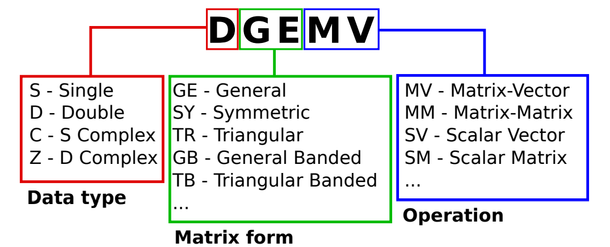
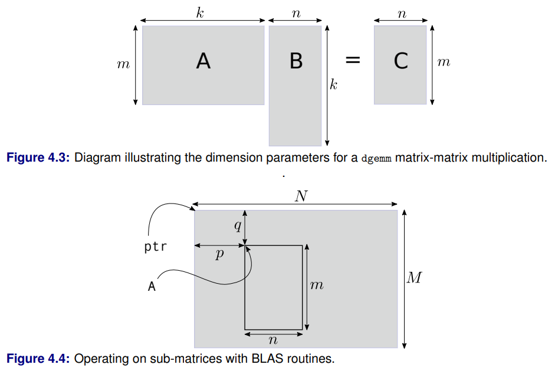

# High Performance Computing Notes

This provides a brief overview of the HPC curriculum and my notes for the course.

## Compilation

This can be broken down into three stages:

1. Preprocessing: the preprocessor actions preprocessor statements and merges in header files to create a single *translation unit*
2. Compilation: the compiler translates this translation unit into assembly code instructions
3. Assembling: the assembler takes the assembly instructions produced by the compiler and creates *relocatable object code*
4. Linker: either dynamically (runtime) or statically (compile time) links object files together to create an executable

### Preprocessing

Executes preprocessor macros such as `#include`, `#define`, `#if-#endif` statements. To see the output of this process, use the `-E` flag such as `g++ -E file1.cpp -o file1.ii`.

### Compilation

Translates C++ instructions from the translation unit into low level assembly code. To see the output, use the `-S` flag such as `g++ -S file1.cpp`. These instructions are specific to the target hardware of the system, such as x86 or ARMv8.

### Assembly

Converts assembly code into binary machine code instructions that can be directly understood by the processor. It then can be put together with other object code (relocatable) by the linker.

### Linking

Linking is the process of connecting the compiled object code generated from different source code files into a single executable. The source code may make reference to *symbols* provided by external libraries `*.a` or `*.so`. Compiler and linker options may be specified as below.

#### Search Paths

The compiler will search through a number of standard locations when looking for external libraries, for example `/usr/lib` for libraries and `/use/include` for headers on Linux systems. If a library is located elsewhere, the compiler must be told additional paths in which to search with the `-L` flag, place before the library itself:

```bash
g++ -o myprog file1.o file2.o -L/path/to/my/lib -lmylib
```

Similarly when compiling, if header files are located in a non-standard path, the compiler can be instructed to search these paths using the `-I` flag.

```bash
g++ -c -o file1.o -I/path/to/my/headers file1.cpp
```

These can be combined if compiling and linking together:

```bash
g++ -o myprog -I/path/to/my/headers -L/path/to/my/lib file1.cpp -lmylib
```

#### Warnings

Different levels of warnings can be enabled in the compiler and linker, as described [here](https://gcc.gnu.org/onlinedocs/gcc/Warning-Options.html):

1. `-Wall`: all warnings below
2. `-Wcomment`: nested comments warnings
3. `-Wformat`: incorrect use of format strings in `printf`
4. `-Wunused`: any variables which are declared but not used
5. `-Wimplicit`: functions which are used without declaration (header is missing)
6. `-W`: common programming errors
7. `-Wconversion`: conversion errors
8. `-Wshadow`: redeclaration of a variable

#### Optimisations

The compiler can run certain optimisations if enabled via the `-O` flags:

1. `-O0`: no optimisation at all, no code rearrangement
2. `-O1`: common optimisations with no space trade-off, no instruction scheduling
3. `-O2`: turns on instruction scheduling but does not increase executable size or memory requirement; good for production level
4. `-O3`: turns on options that make the executable larger; e.g. function inlining

#### Debugging and Profiling

To enable debugging symbols so that the program can be debugged and profiled, use the `-g` flag.

```bash
g++ -g -o myprog file1.cpp
```

#### Language Standard

The ISO C++ standard evolves frequently, currently at a pace of every 3 years. The first was published in 1998, 2003, 2011, 2014, 2017, 2020, 2023. Each revision has slightly different language features which may be depracated as time goes on. Use the `-std` argument to tell the compiler which standard to use.

```bash
g++ -std=c+11 -o myprog file1.cpp
```

### External Libraries

An external library is a binary-compiled set of data structures and algorithms which are accessed by one or more application codes through a documented application programming interface (API). Open source libraries typically contain well-tested and documented community code. To tell

#### Specifying external libraries

Library names on Linux typically start with `lib` and either have a `.a` (static) or `.so` (dynamic) extension. The part between the `lib` and the extension is the *basename*. The compiler will choose to link dynamically by default if only the basename is provided with the `-l` option. For example in the BLAS library:

```bash
g++ -o myprog file1.o file2.o -lblas
```

OR

```bash
g++ -o myprog file1.o file2.o /usr/lib/libblas.so
```

Dynamic linking adds a reference to the dynamic library file `*.so` in the executable. When the executable is run, the dynamic library must also be available and is located by the operating system. Static linking copies the used symbols from the library file into the resulting executable, to run without the original library files. However the executable is much bigger in size.

Some libraries depend on other libraries and all must be specified for the linking process to complete. When the compiler encounters a symbol in a translation unit or library which does not exist in that library, it will look for it in the libraries which follow using the ordering specified on the command-line.

For example, the LAPACK library uses routines from the BLAS library:

```bash
g++ -o myprog file1.o file2.o -llapack -lblas
```

#### Using an external library

1. Read the documentation for the library
2. Install the library (download the required files)
3. `#include` the header files
4. Call the library API to access functions, classes as required
5. Compile our source code to object code `g++ -c -I/path/to/headers -o test.o test.cpp`
6. Link the external library file when building the executable `g++ -o test test.o /path/to/library/libext.so` OR `g++ -o test -L/path/to/library test.o -lext`

Where `ext` is the basename of the library (e.g. `fftw3`, `boost_program_options`, `blas`, `lapack`).

#### Example libraries for scientific computing

1. Numerical libraries: `BLAS`, `LAPACK`, `ScaLAPACK`, `ARPACK`, `Intel MKL`, PDEs: `PETSc`, scientific: `MPI`, `OpenMP`, `FFTW`, `GSL`, `Trilinos`, general: `boost`
2. `FFTW`: Performs real or complex discrete Fourier transforms of arbitrary size, works best with small prime factors (e.g. 900), supports MPI parallel compute. `g++ myprog.cpp -lfftw3`
3. `Boost`: Set of algorithms and data structures which are portable across operating systems. They may be provided as compiled libraries, or header-only libraries (which do not require explicit linking). Some Boost libraries have inter-dependencies, you must link to the target library plus all of its dependencies: `g++ myprog.cpp -lboost_iostreams -lboost_filesystem -lboost_system`


### Command-line arguments

It is possible to pass arguments to the program at runtime. `argc` tells us the number of parameters (int) and `argv` gives an array of characters (similar to string) array which contains the actual arguments to be parsed.

```bash
./myprog 0 10
```

```cpp
#include <iostream>
#include <boost/program_options.hpp>
namespace po = boost::program_options;  // alias namespace

int main(int argc, char* argv[]) {
    po::options_description opts("Available options.");
    opts.add_options(
        ("start", po::value<int>()->default_value(0),
        "Starting value.")
        ("end", po::value<int>()->default_value(10),
        "Ending value.")
        ("help", "Print help message."));

    po::variables_map vm;
    po::store(po::parse_command_line(argc, argv, opts), vm);
    po::notify(vm);

    if (vm.count("help")) {
        std::cout << opts << std::endl;
    }
    const int start = vm["start"].as<int>();
    const int end = vm["end"].as<int>();
}
```

## Debuggers

The GNU debugger `gdb` can be attached to an executable when it is run to debug your code, allowing you to see exactly where an error occurs, and the values of variables at each step. It can be run in the shell like this:

```bash
g++ -g -o myprog file1.cpp file2.cpp
gdb ./myprog
```

Some helpful commands while in `gdb` are below:

1. `r` or `run` to run the code
2. `n` or `next` to evaluate the next statement
3. `s` or `step` to step into a function
4. `c` or `continue` to continue running the code to the end, or next breakpoint
5. `bt` to list the functions in the order they were called to get to the current point, the call stack. The most recent (lowest level) call is at the top, and the earliest (highest level) is at the bottom, usually `main()`
6. `f` or `frame` to change to one of the frames seen in the backtrace; print out the line of code where it exists
7. `list` will print the lines around the current point in the code. Running it again will print the next lines
8. `p` or `print` will inspect the variable in memory
9. `x` to examine a block of memory with a format string e.g. `x/20dw var` 20 decimal values from the pointer var
10. `b` sets a breakpoint at the current line, so GDB will pause everytime that line is encountered again
11. `help` and `quit`

## Basic Linear Algebra Subroutines (BLAS)

[BLAS](http://www.netlib.org/blas) includes core explicit operations on matrices and vectors such as matrix-vector and matrix-matrix multiplications. More advanced linear algebra operations such as solving linear systems and computing eigenvalues, are instead provided by the Linear Algebra PACKage (LAPACK). BLAS consists of three levels:

1. Level 1: Vector-vector routines
2. Level 2: Matrix-vector routines
3. Level 3: Matrix-matrix routines

The reference BLAS implementation and other legacy numerical libraries are still written in Fortran to maintain compatibility with many legacy scientific and egineering codes still in use. Thus we must understand how we can link to a Fortran 90 library.

### Linking to BLAS

```bash
# Actual object code: /usr/lib/libblas.so
g++ myprog.cpp -lblas
```

### Using Fortrain libraries in C++

Fortran appends the function name with an underscore `_` whereas C/C++ compilers do not. Additionally, C++ supports function overloading, and thus mangles the function names with parameter datatypes to ensure they are always unike. To call Fortran 90 functions from our C++ code, we need to add the underscore and turn off the name mangling:

```cpp
// A convenient macro to fix differences in symbol names between C and Fortrain
#define F77NAME(x) x##_

// Function prototypes for the BLAS functions we will use: blas
// Tell the compiler to use "C"-style symbol names (without name mangling)
extern "C" {
    double F77NAME(ddot)   (const int& n,
                            const double *x, const int& incx,
                            const double *y, const int& incy);
}

// Call the Fortran function from C code
double a = F77NAME(ddot)(n, input1, 1, input2, 1);
```

### Using `cblas`

There is a C based API for BLAS, as an alternative usage.

```cpp
#include <iostream>
#include <cstdlib>
#include <cblas.h>

int main() {
    // Allocate memory for vectors
    const int N = 64;
    double* x = new double[N];
    double* y = new double[N];
    double z = 0.0;

    // Randomize x,y inputs
    std::srand(time(0));
    for (int i=0; i<N; i++) {
        x[i] = (double)(rand()) / RAND_MAX;
        y[i] = (double)(rand()) / RAND_MAX;
    }

    // Calling BLAS C API, prefixed with `cblas_`
    z = cblas_ddot(N,x,1,y,1);

    std::cout << "Dot product result: " << z << endl;

    // Free dynamic memory
    delete[] x;
    delete[] y;
}
```

### BLAS Routine Naming



BLAS functions follow a concise logical naming structure as seen above. The first character represents the data type of the numbers in the matrices and vectors; the second two letters represent the structure of the matrix (Level 2 and 3 routines); the last letters represent the operation to be performed.

## Matrix Forms

1. General: A fully dense matrix where all M x N entries are potentially non-zero
2. Symmetric: Matrix where a_ij = a_ji; M = N
3. Triangular: Lower triangular a_ij=0 for i<j; upper triangular a+ij=0 for i>j

### Matrix Storage

Memory in a computer is addressed linearly; we can store in *row-major* or *column-major* format. In row-major, elements along the same row will be adjacent in memory. Fortran codes use column-major format, where elements down the same column will be arranged adjacent in memory.

**Conventional storage** will be used for general matrixes, where all M x N elements are allocated and stored in memory.

**Packed storage** can be used with symmetric or triangular matrix where the non-zero data is packed in *column-major* format, skipping all zero elements.


**Banded storage** assumes that the diagonals (K_L lower, K_U upper, 1 middle) contain non-zero elements. This is organised in a (K_L + K_U + 1) x N matrix, where each row of this matrix corresponds to a diagonal of the original matrix.

It is important to know which types of storage and operations in BLAS to use; in the interest of performance and memory efficiency. If a general routine is used on a diagonal matrix; many operations would be wasted calculating the resultant '0' elements of the output.

## BLAS Examples

### BLAS Level 1

Consider the dot product of two vectors `x` and `y`, use the BLAS routine `ddot`. This requires 5 parameters:

* `n` specifies the number of elements in the vector
* `x` and `y` are pointers to arrays of `doubles` specifying the input vectors
* `incx` and `incy` specify the stride through vectors `x` and `y`; typically 1. May be different when performing a vector operation on a row of a matrix that is stored in column-major format
* `z` is a scalar return value of the routine

```cpp
#include <iostream>
#include <cstdlib>
#define F77NAME(x) x##_
extern "C" {
    double F77NAME(ddot) (const int& n,
                          const double *x, const int& incx,
                          const double *y, const int& incy);
}

int main() {
    // Allocate memory for vectors
    const int N = 64;
    double* x = new double[N];
    double* y = new double[N];
    double z = 0.0;

    // Randomize x,y inputs
    std::srand(time(0));
    for (int i=0; i<N; i++) {
        x[i] = (double)(rand()) / RAND_MAX;
        y[i] = (double)(rand()) / RAND_MAX;
    }

    // Calling BLAS C API, prefixed with `cblas_`
    z = F77NAME(ddot)(N,x,1,y,1);

    std::cout << "Dot product result: " << z << endl;

    // Free dynamic memory
    delete[] x;
    delete[] y;
}
```

### BLAS Level 2

The multiplication of a general full matrix and a vector can be performed by using the level 2 BLAS routine `dgemv`. The BLAS routine prototype is given by:

y <- \alpha Ax + \beta y

```cpp
void F77NAME(dgemv) (const char& trans, const int& m,
                     const int& n, const double& alpha,
                     const double* A, const int& lda,
                     const double* x, const int& incx,
                     const double& beta, double* y,
                     const int& incy);
```

The routine actually performs the matrix-vector product of `A` and `x` plus a scalar multiple of `y`. Therefore we must pay attention to the contents of our `y` array before entering the routine, or ensure `beta` is set to zero. Recall that the matrix, given by the double-precision array `A` should be stored as a full matrix in *column-major* ordering. The `trans` parameter is a single character which indicates to use `A` as given (`N`) or to operate with the transposition of `A` instead (`T`). The `LDA` parameter describes the leading dimension of the matrix.

In contrast, `m` specifies the number of rows, `n` specifies the number of columns, on which we want to operate. Together these parameters allow us to operate on sub-matrices by choosing `m` < `lda`.

```cpp
#include <iostream>
#include <cstdlib>
using namespace std;

#define F77NAME(x) x##_
extern "C" {
    double F77NAME(dgemv) (const char&   trans, const int&      m,
                           const int&    n,     const double&   alpha,
                           const double* A,     const int&      lda,
                           const double& x,     const int&      incx,
                           const double& beta,  double*         y,
                           const int&    incy);
}

int main() {
    // Matrix allocation
    const int N = 8;
    const int M = 6;
    double* A = new double[N*M];
    // Input/output vectors
    double* x = new double[N];
    double* y = new double[M];

    // Randomise elements in matrix and input vector
    for (int i=0; i<N; ++i) {
        for (int j=0; j<M; ++j) {
            A[i*M+j] = double(rand())/RAND_MAX;
        }
        x[i] = double(rand())/RAND_MAX;
    }

    // Perform matrix-vector product
    F77NAME(dgemv)('N',M,N,1.0,A,M,x,1,0.0,y,1);
}
```

### BLAS Level 3

The general matrix-matrix multiply operation is given by:

C <- \alpha AB + \beta C

and the corresponding BLAS routine prototype:

```cpp
void F77NAME(dgemm) (
            const char&   trans,    const char&     transb,
            const int&    m,        const int&      n,
            const int&    k,        const double&   alpha,
            const double* A,        const int&      lda,
            const double* B,        const int&      ldb,
            const double& beta,     double*         C,
            const int&    ldc);
```

Again, take care to set `beta` to zero, or the matrix elements of `c` to zeroif only the product of `A` and `B` is required. For each matrix we must specify a leading dimension. Note that since the number of columns of `A` must equal the number of rows of `B`, we are only asked to provide three matrix dimensions `m`, `n`, `k`.

### Operating on sub-matrices



BLAS routines can operate on submatrices by:

1. Set the `lda` parameter to `M` as this describes how long a column is in *memory*.
2. Use the values of `m` and `n` to specify the size of the sub-matrix.
3. Use pointer arithmetic to provide the starting point of the subimatrix. E.g. `A = ptr + (p*M) + q`.

### BLAS Documentation

Documentation for the BLAS API is available [here](http://www.netlib.org/blas/index.html) or in [pdf form](doc/blasqr.pdf). Alternatively, the CBLAS wrapper can be used, as described [here](#using-cblas). The CBLAS wrappers, once installed, can be found at `/usr/include/cblas.h` on Linux systems. Other BLAS implementations include ATLAS, OpenBLAS, MKL and GotoBLAS.