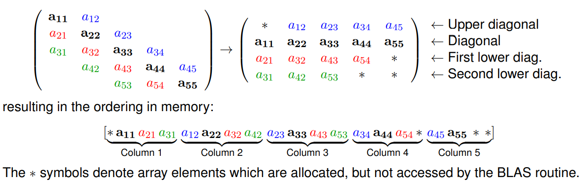

# High Performance Computing Notes

This provides a brief overview of the HPC curriculum and my notes for the course.

## Quick links

To use code linting with `cblas.h`, add the headerfile to your local workspace. Its helpful when you are writing code on your local machine without the library, but executing on another environment where the library is installed.

* [BLAS quick reference](https://www.netlib.org/lapack/lug/node145.html)
* [BLAS documentation pages](http://www.netlib.org/blas)
* [LAPACK quick reference](https://usermanual.wiki/Document/LAPACK20Quick20Reference20Guide.1468851174/view)
* [LAPACK documentation pages](http://www.netlib.org/lapack/explore-html/modules.html)

## Installation and Setup

If you are using your own machine to compile and run your code, here's a guide to using Linux:

### Windows Subsystem for Linux (WSL)

If you are using WSL virtualisation, you simply need to run `ubuntu` in powershell to enter your distro. Then install the required libraries with `sudo apt install -y libblas-dev liblapack-dev`. The libaries will be located in `/lib/x86_64-linux-gnu`.
## Compilation

This can be broken down into three stages:

1. Preprocessing: the preprocessor actions preprocessor statements and merges in header files to create a single *translation unit*
2. Compilation: the compiler translates this translation unit into assembly code instructions
3. Assembling: the assembler takes the assembly instructions produced by the compiler and creates *relocatable object code*
4. Linker: either dynamically (runtime) or statically (compile time) links object files together to create an executable

### Preprocessing

Executes preprocessor macros such as `#include`, `#define`, `#if-#endif` statements. To see the output of this process, use the `-E` flag such as `g++ -E file1.cpp -o file1.ii`.

### Compilation

Translates C++ instructions from the translation unit into low level assembly code. To see the output, use the `-S` flag such as `g++ -S file1.cpp`. These instructions are specific to the target hardware of the system, such as x86 or ARMv8.

### Assembly

Converts assembly code into binary machine code instructions that can be directly understood by the processor. It then can be put together with other object code (relocatable) by the linker.

### Linking

Linking is the process of connecting the compiled object code generated from different source code files into a single executable. The source code may make reference to *symbols* provided by external libraries `*.a` or `*.so`. Compiler and linker options may be specified as below.

#### Search Paths

The compiler will search through a number of standard locations when looking for external libraries, for example `/usr/lib` for libraries and `/use/include` for headers on Linux systems. If a library is located elsewhere, the compiler must be told additional paths in which to search with the `-L` flag, place before the library itself:

```bash
g++ -o myprog file1.o file2.o -L/path/to/my/lib -lmylib
```

Similarly when compiling, if header files are located in a non-standard path, the compiler can be instructed to search these paths using the `-I` flag.

```bash
g++ -c -o file1.o -I/path/to/my/headers file1.cpp
```

These can be combined if compiling and linking together:

```bash
g++ -o myprog -I/path/to/my/headers -L/path/to/my/lib file1.cpp -lmylib
```

#### Warnings

Different levels of warnings can be enabled in the compiler and linker, as described [here](https://gcc.gnu.org/onlinedocs/gcc/Warning-Options.html):

1. `-Wall`: all warnings below
2. `-Wcomment`: nested comments warnings
3. `-Wformat`: incorrect use of format strings in `printf`
4. `-Wunused`: any variables which are declared but not used
5. `-Wimplicit`: functions which are used without declaration (header is missing)
6. `-W`: common programming errors
7. `-Wconversion`: conversion errors
8. `-Wshadow`: redeclaration of a variable

#### Optimisations

The compiler can run certain optimisations if enabled via the `-O` flags:

1. `-O0`: no optimisation at all, no code rearrangement
2. `-O1`: common optimisations with no space trade-off, no instruction scheduling
3. `-O2`: turns on instruction scheduling but does not increase executable size or memory requirement; good for production level
4. `-O3`: turns on options that make the executable larger; e.g. function inlining

#### Debugging and Profiling

To enable debugging symbols so that the program can be debugged and profiled, use the `-g` flag.

```bash
g++ -g -o myprog file1.cpp
```

#### Language Standard

The ISO C++ standard evolves frequently, currently at a pace of every 3 years. The first was published in 1998, 2003, 2011, 2014, 2017, 2020, 2023. Each revision has slightly different language features which may be depracated as time goes on. Use the `-std` argument to tell the compiler which standard to use.

```bash
g++ -std=c+11 -o myprog file1.cpp
```

### External Libraries

An external library is a binary-compiled set of data structures and algorithms which are accessed by one or more application codes through a documented application programming interface (API). Open source libraries typically contain well-tested and documented community code. To tell

#### Specifying external libraries

Library names on Linux typically start with `lib` and either have a `.a` (static) or `.so` (dynamic) extension. The part between the `lib` and the extension is the *basename*. The compiler will choose to link dynamically by default if only the basename is provided with the `-l` option. For example in the BLAS library:

```bash
g++ -o myprog file1.o file2.o -lblas
```

OR

```bash
g++ -o myprog file1.o file2.o /usr/lib/libblas.so
```

Dynamic linking adds a reference to the dynamic library file `*.so` in the executable. When the executable is run, the dynamic library must also be available and is located by the operating system. Static linking copies the used symbols from the library file into the resulting executable, to run without the original library files. However the executable is much bigger in size.

Some libraries depend on other libraries and all must be specified for the linking process to complete. When the compiler encounters a symbol in a translation unit or library which does not exist in that library, it will look for it in the libraries which follow using the ordering specified on the command-line.

For example, the LAPACK library uses routines from the BLAS library:

```bash
g++ -o myprog file1.o file2.o -llapack -lblas
```

#### Using an external library

1. Read the documentation for the library
2. Install the library (download the required files)
3. `#include` the header files
4. Call the library API to access functions, classes as required
5. Compile our source code to object code `g++ -c -I/path/to/headers -o test.o test.cpp`
6. Link the external library file when building the executable `g++ -o test test.o /path/to/library/libext.so` OR `g++ -o test -L/path/to/library test.o -lext`

Where `ext` is the basename of the library (e.g. `fftw3`, `boost_program_options`, `blas`, `lapack`).

#### Example libraries for scientific computing

1. Numerical libraries: `BLAS`, `LAPACK`, `ScaLAPACK`, `ARPACK`, `Intel MKL`, PDEs: `PETSc`, scientific: `MPI`, `OpenMP`, `FFTW`, `GSL`, `Trilinos`, general: `boost`
2. `FFTW`: Performs real or complex discrete Fourier transforms of arbitrary size, works best with small prime factors (e.g. 900), supports MPI parallel compute. `g++ myprog.cpp -lfftw3`
3. `Boost`: Set of algorithms and data structures which are portable across operating systems. They may be provided as compiled libraries, or header-only libraries (which do not require explicit linking). Some Boost libraries have inter-dependencies, you must link to the target library plus all of its dependencies: `g++ myprog.cpp -lboost_iostreams -lboost_filesystem -lboost_system`


### Command-line arguments

It is possible to pass arguments to the program at runtime. `argc` tells us the number of parameters (int) and `argv` gives an array of characters (similar to string) array which contains the actual arguments to be parsed.

```bash
./myprog 0 10
```

```cpp
#include <iostream>
#include <boost/program_options.hpp>
namespace po = boost::program_options;  // alias namespace

int main(int argc, char* argv[]) {
    po::options_description opts("Available options.");
    opts.add_options(
        ("start", po::value<int>()->default_value(0),
        "Starting value.")
        ("end", po::value<int>()->default_value(10),
        "Ending value.")
        ("help", "Print help message."));

    po::variables_map vm;
    po::store(po::parse_command_line(argc, argv, opts), vm);
    po::notify(vm);

    if (vm.count("help")) {
        std::cout << opts << std::endl;
    }
    const int start = vm["start"].as<int>();
    const int end = vm["end"].as<int>();
}
```

## Debuggers

The GNU debugger `gdb` can be attached to an executable when it is run to debug your code, allowing you to see exactly where an error occurs, and the values of variables at each step. It can be run in the shell like this:

```bash
g++ -g -o myprog file1.cpp file2.cpp
gdb ./myprog
```

Some helpful commands while in `gdb` are below:

1. `r` or `run` to run the code
2. `n` or `next` to evaluate the next statement
3. `s` or `step` to step into a function
4. `c` or `continue` to continue running the code to the end, or next breakpoint
5. `bt` to list the functions in the order they were called to get to the current point, the call stack. The most recent (lowest level) call is at the top, and the earliest (highest level) is at the bottom, usually `main()`
6. `f` or `frame` to change to one of the frames seen in the backtrace; print out the line of code where it exists
7. `list` will print the lines around the current point in the code. Running it again will print the next lines
8. `p` or `print` will inspect the variable in memory
9. `x` to examine a block of memory with a format string e.g. `x/20dw var` 20 decimal values from the pointer var
10. `b` sets a breakpoint at the current line, so GDB will pause everytime that line is encountered again
11. `help` and `quit`

## Basic Linear Algebra Subroutines (BLAS)

[BLAS](http://www.netlib.org/blas) includes core explicit operations on matrices and vectors such as matrix-vector and matrix-matrix multiplications. More advanced linear algebra operations such as solving linear systems and computing eigenvalues, are instead provided by the Linear Algebra PACKage (LAPACK). BLAS consists of three levels:

1. Level 1: Vector-vector routines
2. Level 2: Matrix-vector routines
3. Level 3: Matrix-matrix routines

The reference BLAS implementation and other legacy numerical libraries are still written in Fortran to maintain compatibility with many legacy scientific and egineering codes still in use. Thus we must understand how we can link to a Fortran 90 library.

### Linking to BLAS

```bash
# Actual object code: /usr/lib/libblas.so
g++ myprog.cpp -lblas
```

### Using Fortrain libraries in C++

Fortran appends the function name with an underscore `_` whereas C/C++ compilers do not. Additionally, C++ supports function overloading, and thus mangles the function names with parameter datatypes to ensure they are always unike. To call Fortran 90 functions from our C++ code, we need to add the underscore and turn off the name mangling:

```cpp
// A convenient macro to fix differences in symbol names between C and Fortrain
#define F77NAME(x) x##_

// Function prototypes for the BLAS functions we will use: blas
// Tell the compiler to use "C"-style symbol names (without name mangling)
extern "C" {
    double F77NAME(ddot)   (const int& n,
                            const double *x, const int& incx,
                            const double *y, const int& incy);
}

// Call the Fortran function from C code
double a = F77NAME(ddot)(n, input1, 1, input2, 1);
```

### Using `cblas`

There is a C based API for BLAS, as an alternative usage.

```cpp
#include <iostream>
#include <cstdlib>
#include <cblas.h>

int main() {
    // Allocate memory for vectors
    const int N = 64;
    double* x = new double[N];
    double* y = new double[N];
    double z = 0.0;

    // Randomize x,y inputs
    std::srand(time(0));
    for (int i=0; i<N; i++) {
        x[i] = (double)(rand()) / RAND_MAX;
        y[i] = (double)(rand()) / RAND_MAX;
    }

    // Calling BLAS C API, prefixed with `cblas_`
    z = cblas_ddot(N,x,1,y,1);

    std::cout << "Dot product result: " << z << endl;

    // Free dynamic memory
    delete[] x;
    delete[] y;
}
```

### BLAS Routine Naming


BLAS functions follow a concise logical naming structure as seen above. The first character represents the data type of the numbers in the matrices and vectors; the second two letters represent the structure of the matrix (Level 2 and 3 routines); the last letters represent the operation to be performed.

## Matrix Forms

1. General: A fully dense matrix where all M x N entries are potentially non-zero
2. Symmetric: Matrix where a_ij = a_ji; M = N
3. Triangular: Lower triangular a_ij=0 for i<j; upper triangular a+ij=0 for i>j

### Matrix Storage

Memory in a computer is addressed linearly; we can store in *row-major* or *column-major* format. In row-major, elements along the same row will be adjacent in memory. Fortran codes use column-major format, where elements down the same column will be arranged adjacent in memory.

**Conventional storage** will be used for general matrixes, where all M x N elements are allocated and stored in memory.

**Packed storage** can be used with symmetric or triangular matrix where the non-zero data is packed in *column-major* format, skipping all zero elements.



**Banded storage** assumes that the diagonals (K_L lower, K_U upper, 1 middle) contain non-zero elements. This is organised in a (K_L + K_U + 1) x N matrix, where each row of this matrix corresponds to a diagonal of the original matrix.

It is important to know which types of storage and operations in BLAS to use; in the interest of performance and memory efficiency. If a general routine is used on a diagonal matrix; many operations would be wasted calculating the resultant '0' elements of the output.

## BLAS Examples

### BLAS Level 1

Consider the dot product of two vectors `x` and `y`, use the BLAS routine `ddot`. This requires 5 parameters:

* `n` specifies the number of elements in the vector
* `x` and `y` are pointers to arrays of `doubles` specifying the input vectors
* `incx` and `incy` specify the stride through vectors `x` and `y`; typically 1. May be different when performing a vector operation on a row of a matrix that is stored in column-major format
* `z` is a scalar return value of the routine

```cpp
#include <iostream>
#include <cstdlib>
using namespace std;
#define F77NAME(x) x##_
extern "C" {
    double F77NAME(ddot) (const int& n,
                          const double *x, const int& incx,
                          const double *y, const int& incy);
}

int main() {
    // Allocate memory for vectors
    const int N = 64;
    double* x = new double[N];
    double* y = new double[N];
    double z = 0.0;

    // Randomize x,y inputs
    std::srand(time(0));
    for (int i=0; i<N; i++) {
        x[i] = (double)(rand()) / RAND_MAX;
        y[i] = (double)(rand()) / RAND_MAX;
    }

    // Calling BLAS C API, prefixed with `cblas_`
    z = F77NAME(ddot)(N,x,1,y,1);

    std::cout << "Dot product result: " << z << endl;

    // Free dynamic memory
    delete[] x;
    delete[] y;
}
```

### BLAS Level 2

The multiplication of a general full matrix and a vector can be performed by using the level 2 BLAS routine `dgemv`. The BLAS routine prototype is given by:

y <- \alpha Ax + \beta y

```cpp
void F77NAME(dgemv) (const char& trans, const int& m,
                     const int& n, const double& alpha,
                     const double* A, const int& lda,
                     const double* x, const int& incx,
                     const double& beta, double* y,
                     const int& incy);
```

The routine actually performs the matrix-vector product of `A` and `x` plus a scalar multiple of `y`. Therefore we must pay attention to the contents of our `y` array before entering the routine, or ensure `beta` is set to zero. Recall that the matrix, given by the double-precision array `A` should be stored as a full matrix in *column-major* ordering. The `trans` parameter is a single character which indicates to use `A` as given (`N`) or to operate with the transposition of `A` instead (`T`). The `LDA` parameter describes the leading dimension of the matrix.

In contrast, `m` specifies the number of rows, `n` specifies the number of columns, on which we want to operate. Together these parameters allow us to operate on sub-matrices by choosing `m` < `lda`.

```cpp
#include <iostream>
#include <cstdlib>
using namespace std;

#define F77NAME(x) x##_
extern "C" {
    double F77NAME(dgemv) (const char&   trans, const int&      m,
                           const int&    n,     const double&   alpha,
                           const double* A,     const int&      lda,
                           const double& x,     const int&      incx,
                           const double& beta,  double*         y,
                           const int&    incy);
}

int main() {
    // Matrix allocation
    const int N = 8;
    const int M = 6;
    double* A = new double[N*M];
    // Input/output vectors
    double* x = new double[N];
    double* y = new double[M];

    // Randomise elements in matrix and input vector
    for (int i=0; i<N; ++i) {
        for (int j=0; j<M; ++j) {
            A[i*M+j] = double(rand())/RAND_MAX;
        }
        x[i] = double(rand())/RAND_MAX;
    }

    // Perform matrix-vector product
    F77NAME(dgemv)('N',M,N,1.0,A,M,x,1,0.0,y,1);
}
```

### BLAS Level 3

The general matrix-matrix multiply operation is given by:

C <- \alpha AB + \beta C

and the corresponding BLAS routine prototype:

```cpp
void F77NAME(dgemm) (
            const char&   trans,    const char&     transb,
            const int&    m,        const int&      n,
            const int&    k,        const double&   alpha,
            const double* A,        const int&      lda,
            const double* B,        const int&      ldb,
            const double& beta,     double*         C,
            const int&    ldc);
```

Again, take care to set `beta` to zero, or the matrix elements of `c` to zeroif only the product of `A` and `B` is required. For each matrix we must specify a leading dimension. Note that since the number of columns of `A` must equal the number of rows of `B`, we are only asked to provide three matrix dimensions `m`, `n`, `k`.

### Operating on sub-matrices


BLAS routines can operate on submatrices by:

1. Set the `lda` parameter to `M` as this describes how long a column is in *memory*.
2. Use the values of `m` and `n` to specify the size of the sub-matrix.
3. Use pointer arithmetic to provide the starting point of the subimatrix. E.g. `A = ptr + (p*M) + q`.

### BLAS Documentation

Documentation for the BLAS API is available [here](http://www.netlib.org/blas/index.html) or in [pdf form](doc/blasqr.pdf). Alternatively, the CBLAS wrapper can be used, as described [here](#using-cblas). The CBLAS wrappers, once installed, can be found at `/usr/include/cblas.h` on Linux systems. Other BLAS implementations include ATLAS, OpenBLAS, MKL and GotoBLAS.

## LAPACK

LAPACK builds upon the basic operations of BLAS, for more advanced linear algebra operations. To link to LAACK, add the linker flag:

```bash
g++ myprog.cpp -llapack -lblas
```

### Solving a general linear system of equations

LAPACK can be used to solve AX = B using `dgesv`, where A,X,B are matricies.

```cpp
#define F77NAME(x) x##_
extern "C" {
    void F77NAME(dgesv)(const int& n, const int& nrhs, const double * A,
                        const int& lda, int * ipiv, double * B,
                        const int& ldb, int& info);
}
```

The system computes the LU decomposition of A with partial pivoting, then solves for X. `n` is the rank of the system, which must necessarily be square to avoid an under or over-determined system. `nrhs` specifies the number of columns of B and X. The LU decomposition, A = PLU where P is a permutation amtrix arising from pivoting. P is captured by an array of pivot indices, for which we must provide the routine with an empty integer array, `ipiv` of size `n`.

LAPACK routines overwrite their input variables during execution; A will be overwritten with the factors L and U from the LU-decomposition A = PLU.

The `info` parameter provides information on whether the operation was successful, `0` if successful, `-k` if k-th parameter was invalid, `k` if U(i,i) = 0 and therefore U is singular.

### LAPACK Storage Formats

LAPACK also has compact storage formats like BLAS, such as packed or banded storage. Of particular note is the matrix A. Unlike the BLAS routine `dgbmv`, the size of the matrix for `dgbsv` must be (1 + 2K_L + K_U) * N. The matrix storage looks as below:


Example for `dgesv` to solve Ax = y:

```cpp
#include <iostream>
#include <cstdlib>
using namespace std;

#define F77NAME(x) x##_
extern "C" {
    // LAPACK routine for solving systems of linear equations
    void F77NAME(dgesv)(const int& n, const int& nrhs, const double * A,
                        const int& lda, int * ipiv, double * B,
                        const int& ldb, int& info);
    // BLAS routine for performing matrix-vector multiplication
    void F77NAME(dgemv)(const char& trans, const int& m,
                        const int& n, const double& alpha,
                        const double* A, const int& lda,
                        const double* x, const int& incx,
                        const double& beta, double* y,
                        const int& incy);
}

int main() {
    const int n = 10; // Define system size
    const int nrhs = 1;
    int info = 0;
    double* A = new double[n*n]; // Allocate matrix and vectors
    double* x = new double[n];
    double* y = new double[n];
    int* ipiv = new int[n]; // Vector for pivots

    // Populate A and x with random numbers
    srand(time(0));
    for (int i = 0; i < n*n; ++i) A[i] = (double)(rand())/RAND_MAX;
    for (int i = 0; i < n; ++i) x[i]   = (double)(rand())/RAND_MAX;

    // Compute product y
    F77NAME(dgemv)(’N’, n, n, 1.0, A, n, x, 1, 0.0, y, 1);

    // Solve system in-place (y is RHS on input and solution on output)
    F77NAME(dgesv)(n, nrhs, A, n, ipiv, y, n, info);

    // Print out result and compare with original input
    for (int i = 0; i < n; ++i) cout << x[i] << ", " << y[i] << endl;
}

```

The K_L padding rows can be unset on input. The banded matrix should be stored starting at position A + kl*n. After executing this routine, the first 1 + K_L + K_U rows contain the factorisation of the banded matrix, while the last K_L rows contrain multipliers used during factorisation.

### Pre-factoring matrices

`dgbsv` solves the problem by first factorising the matrix A using LU decomposition and then solving the resulting system. If the system is to be solved repeatedly, the matrix factorisation need only be performed once. This is achieved by calling the LAPACK function `dgbtrf`.

```cpp
void F77NAME(dgbtrf) (const int& m, const int& n, const int& kl,
                      const int& ku, double* A, const int& lda,
                      int* ipiv, int& info);

int n = 50; // Problem size
int kl = 1; // Lower diagonal bandwidth
int ku = 2; // Upper diagonal bandwidth
int nrhs = 1; // Number of RHS vectors
int ldab = 1 + 2*kl + ku;// Number of rows in compressed matrix
int ldb = n; // Size of RHS vector
int info;
double* A = new double[ldab*n]; // Banded matrix + ’fill’ row
int* piv = new int[n]; // Pivot data
double* b = new double[n]; // RHS vector / output vector

// ... Populate matrix A in banded format and vector b here

// Solve banded matrix system Ax=b.
// On input, b contains RHS vector. On output, b contains solution.
F77NAME(dgbsv) (n, kl, ku, nrhs, A, ldab, piv, b, ldb, info);
if (info) {
    cout << "ERROR: An error occurred in DGBSV: " << info << endl;
}
```

Once factored, the system can be solved quickly for any given solution using the routine:

```cpp
void F77NAME(dgbtrs)   (const char& trans, const int& n, const int& kl,
                        const int &ku, const int& nrhs, const double* A,
                        const int& lda, const int* ipiv, double* b,
                        const int& ldb, int& info);
```

```cpp
#include <iostream>
#include <cstdlib>
using namespace std;

#define F77NAME(x) x##_
extern "C" {
    void F77NAME(dsyev)(const char& v, const char& ul, const int& n,
                        double* a, const int& lda, double* w,
                        double* work, const int& lwork, int* info );
}

int main() {
    const int n = 10, lda = n, ldv = n;
    int info = 0, lwork = -1;
    double wkopt;
    double* A = new double[n*n];
    double* w = new double[n];
    double* work;

    srand(time(0));
    for (int i = 0; i < n; ++i) // Populate random symmetric matrix
    for (int j = i; j < n; ++j)
    A[i*n+j] = A[j*n+i] = (double)(rand())/RAND_MAX;

    // Query for optimal workspace size
    F77NAME(dsyev)(’V’, ’U’, n, A, lda, w, &wkopt, lwork, &info);

    // Allocate workspace
    lwork = (int)wkopt;
    work = new double[lwork];

    // Compute eigenvalues - A is replaced with eigenvectors
    F77NAME(dsyev)(’V’, ’U’, n, A, lda, w, work, lwork, &info);

    // Print eigenvalues.
    for (int i = 0; i < n; ++i) {
        cout << "EV: " << i << ": " << w[i] << endl;
    }

    delete[] A, w, work;
}
```
### Finding eigenvalues and eigenvectors

Symmetric matrices have real eigenvalues and can be found using `dsyev`.

```cpp
void F77NAME(dsyev)(const char& v, const char& ul, const int& n,
                    double* a, const int& lda, double* w,
                    double* work, const int& lwork, int* info );
```

The parameter `v` indicates if eigenvectors should be computed 'V' or not 'N'. If computed, these are stored in `A`. In either case, the original matrix is overwritten. Since the matrix is assumed symmetric, only the upper or lower triangle need be provided, indicated with the `ul` parameter with 'U' or 'L' respectively. The array `w` is used to output the computed eigenvalues.

The parameters `work` and `lwork` provide the LAPACK routine with some tmeporary memory, called a workspace.

#### LAPACK Workspaces

The size of the workspace is specified using a parameter `lwork`, referenced through the pointer `work`. The amount of memory required depends on the routine and provided parameters.

For `dsyev`, it depends on whether eigenvectors are requested. Instead of computing the necessary size, we can call `dsyev` with `lwork`=-1 and a workspace `work` of size 1. The routine will only calculate the optimal workspace size and put this integer into work[0].

We can then typecast this value to an integer and make a second call to `dsyev` with the correcly allocated workspace to perform the actual eigenvalue computation.

```cpp
// Calculate desired memory size
double wkopt;
int lwork = -1;
F77NAME(dsyev)(’V’, ’U’, n, A, lda, w, &wkopt, lwork, &info);

// Run the actual linear algebra solver, symmetric matrix
lwork = (int)wkopt;
work = new double[lwork];
F77NAME(dsyev)(’V’, ’U’, n, A, lda, w, work, lwork, &info);
```

## Git version control

### Distributed vs centralised version control system (VCS)

Centralised VCS owns a master copy of the code and all developers send revisions to and from the server, requiring an active connection to the server. Distributed VCS, developers own a local copy of the code, including all revisions, on their computer. To share code changes, groups of commits are sent between developers in a peer-to-peer manner.

### Git

Git was originally designed and developed to manage the source code of the Linux kernel. It offers remote repositories, code branching and merging, tagging of milestones, forking of repositories, data integrity (verifiable hashes). It represents the chronology of developement as a linked list of *commits*. *refspec* refers to a label or a specific commit hash.

The development chronology can be allowed to diverge into different *branches*, and at some point be *merged* back into the *main* branch.

```bash
git add hello.txt               # Stage changes to be committed
git rm hello.txt                # Delete a file. File still exists in earlier commits
git mv hello.txt bye.txt        # Move/rename a file under version control
git checkout cb17576            # Go to earlier commit cb17576
git checkout main               # Go to latest commit on branch 'main'

# Dealing with remote repositories
git commit -m "commit message"  # Make a commit
git diff                        # Review changes made
git diff --cached               # Review changes to be committed
git log                         # Review the log of commits

# Clone remote repositories
git clone <repository-location> [<directory>]
git remote -v                   # List remote repositories

# Working with remote repositories, push/pull commits
git push [<repository-label> [<refspec>]]
git pull [<repository-label> [<refspec>]]
```

### Rebasing

When two developers make different changes to the same part of the code, a conflict arises. Developer B can pull the new commit from Developer A and merges those changes into her new branch. Alternatively, Developer B reapplies her changes on top of those from Developer A, `git pull --rebase`.

1. Commits by Developer B are reversed back to the common ancestor
2. Changes from Developer A are pulled from the server and applied; *fast-forwarding*
3. Commits from Developer B are applied on top
4. Any conflicting changes are resolved by Developer B

### Branching

Branches allow cde to be developed and tested away from the main code development path. To create a branch:

```bash
git branch <branch-name>        # Create new branch
git checkout <branch-name>      # Change to a different branch
git branch [-a]                 # See list of branch, -a for remote branches

git push origin <branch-name>   # Push to a specific branch
```

### Merging

Merging combines changes from one branch into a target branch. Typically another branch is merged into the main branch. If there are conflicting changes, need to resolve these maually. Git will report a list of files which have conflicts, and leave two versions of the conflicting sections of code in the source files annotated with tags `<<<` and `>>>`.

```bash
git merge <branch-name>         # Merge another branch into current branch
```

### Tagging

Tags provide a way to bookmark specific points in a project's history. They are conceptually just like labels, but tied to a specific commit. To create a tag:

```bash
git tag v2.0 -m "Completed version 2.0" # Create a tag
git tag -l      # List all available tags
git tag -d v2.0 # Delete a tag with -d
```

### Set git config user

```bash
git config --global user.email "your-name@imperial.ac.uk"
git config --global user.name  "Your Name"
```

## Build Systems

### Make

`make` is a build system used to manage the building of the project; only updated/changed files will be recompiled through a dependency tree. The format is:

```makefile
<target_name>: <dependencies>
    <command to run to build target; must output the target_name file>
```

The first target will become the *default target* of the system.

An example to run `g++ -o myprog compiler-main.cpp compiler-norm.cpp -lblas`.

```makefile
default: myprog

libs = -lblas

myprog: compiler-main.o compiler-norm.o
    g++ -o $@ $^ $(libs)

compiler-main.o: compiler-main.cpp compiler-norm.h
    g++ -o $@ -c $<

compiler-norm.o: compiler-norm.cpp compiler-norm.h
    g++ -o $@ -c $<
```

#### Automatic Variables

As the program gets more complicated, we can use variables `$(var)` in the Makefile to simplify our code. [Automatic variables](https://www.gnu.org/software/make/manual/html_node/Automatic-Variables.html) are also available:

* `$@`: name of target
* `$<`: name of first prerequisite
* `$^`: names of all prerequisites
* `$?`: names of all prerequisites that are newer than the target

Some variables are predefined but may be overridden by the user.

* `CXX`: C++ compiler to use, default value: `g++`
* `CXXFLAGS`: extra flags to give to the C++ compiler, default value: (empty)
* `LDLIBS`: libraries to link, default value: (empty)
* `LDFLAGS`: extra flags to be given when linking, default value: (empty)

#### Implicit rules

*Implicit rules* are often used for standard tasks, such as compiling source files into object files. These rules use the file extension of the target and dependencies to decide which commands to run.

```Makefile
default: myprog

libs = -lblas

myprog: compiler-main.o compiler-norm.o
    g++ -o $@ $^ $(libs)

# Build all -o files in the same way
%.o: %.cpp compiler-norm.h
    g++ -o $@ -c $<

# Delete all build output files
.PHONY: clean   # No output files
clean:
    rm -f *.o myprog
```

Making more extensive use of implicit rules:

```Makefile
CC=g++
CXXFLAGS=-std=c++11 -Wall -O2
HDRS=myfunction.h

default: myprog

myprog.o: myprog.cpp

myfunction.o: myfunction.cpp $(HDRS)

myprog: myprog.o myfunction.o
```

#### Pattern rules

*Pattern rules* are custom rules that can be defined. It is essentially an ordinary rule, except the target now contains the `%` symbol, that can match any non-empty string.

### CMake

CMake is a meta-build system that generates the required Makefiles to build the project as specified. It is cross-platform, aware of the different toolchains available on each system. CMake includes a range of scripts to automatically find common libraries in an operating-system agnostic way.

```bash
cmake_minimum_required(VERSION 2.8.9)
project(myprog)
find_package(BLAS REQUIRED)
add_executable(myprog compiler-main.cpp compiler-main.cpp)
target_link_libraries(myprog ${BLAS_LIBRARIES})
```

To keep things clean, usually keep the build system in the `build/` directory.

```bash
mkdir build
cd build
cmake ../
```

CMake supports variables with the `set` command. Find common libraries with `find_package`. Link libraries with `target_link_libraries`.

```bash
set(sources "myprog.cpp myfunction.cpp")
find_package(BLAS REQUIRED)
target_link_libraries(myprog ${BLAS_LIBRARIES})
```

#### Configuring builds

There is a configurable `cmake` tool called `ccmake`, allowing us to configure the build of the project. We might change `CMAKE_BUILD_TYPE` variable to `DEBUG` in order to build a version of our code with debug symbols. After adjusting the configuration, we press `c` to validate the configuration, followed by `g` to generate the Makefiles.

## Testing

Types of tests:

* Unit test: checks an individual code unit or component, used for verifying the correctness of individual functions, classes or other data structures. Each tests only **one** specific concept
* Integration test: checks if multiple components that have been tested independently, behave correctly when combined
* System test: checks a complete system, meets the design specification

### Unit tests

Unit tests verify the correctness of an individual function, else it throws an error and the program exits with a non-zero return value. If the all test case passes, the program exits successfully.

```cpp
double myabs(double x) {
    if (x >= 0) {
        return x;
    } else {
        return -x;
    }
}

// Unit testing the function for multiple inputs
int main() {
    if ( ! (myabs(5) == 5) ) {
        cout << "Failed test myabs(5)" << endl;
        return 1;
    }
    if ( ! (myabs(-7) == 7) ) {
        cout << "Failed test myabs(-7)" << endl;
        return 1;
    }
    return 0;
}
```
### Test frameworks

A testing framework is designed the simplify the process of creating tests for units of code, such as the `Boost` Test framework. Your code is dclared in `mymath.h`, and each routine is called and tested.

```cpp
#include "mymath.h"

#define BOOST_TEST_MODULE MyMath
#include <boost/test/included/unit_test.hpp>

BOOST_AUTO_TEST_CASE( MyMultiply )
{
    BOOST_CHECK( mymultiply(2,3) == 6 );
}

BOOST_AUTO_TEST_CASE( MyAbs )
{
    BOOST_CHECK( myabs(5) == 5 );
    BOOST_CHECK( myabs(-7) == 7 );
}
```

To run the testing code, we need to compile it, along with the code under test. Behind the scenes, Boost creates the `main` routine for our testing code, which does not need to be run explicitly.

```bash
g++ -o mymath-test mymath-test.cpp mymath.cpp
```

Here are some convenient Boost functions:

* `BOOST_CHECK()`: checks that the argument is True, but continues with other tests if failed
* `BOOST_REQUIRE()`: requires that the argument is True, exits if failed
* `BOOST_CHECK_EQUAL(func_call,expected_val)`: same as CHECK(), but gives a detailed error message
* `BOOST_CHECK_CLOSE(func_call,expected_val,tol)`: checks with tolerance, used for floating point

## Documentation

Comments are written with the following syntax:

```cpp
/* C-style comment */
// C++ comment

/**
 * Multiple line comment
 */
```

At minimum, document the following:

* What the program does
* Brief description of each routine, and what the parameters are
* Description of what the routine returns
* Explain complicated code segments

### Doxygen

Doxygen is a tool which extracts the comments in your code and produces a user-friendly HTML web-page documentation describing the classes, functions and variables in your code. It can also perform analysis; generating dependency diagrams between classes, functions, variables etc. It also generates hyperlinks to make it easier to move around large codebases.

Use multi-line comments before classes/functions and triple backslashes for variables, to be picked up by doxygen.

```cpp
/**
 * @brief Perform a single insert step in the insertion sort.
 * @param a array of values to sort.
 * @param p position up to which all values are sorted.
 * @param val the value to insert in the correct place.
 */
void insert(float a[], int p, float val) {
}


/**
 * @class Point
 * @brief Describes a position on the 2D plane.
 */
class Point {
public:
/// Default constructor
Point();
/// Construct point with a given coordinates
Point(double x, double y);
/// Create a copy of an existing point
Point(const Point& pSrc);
/// Clean up and deallocate memory
~Point();

/// Get the x-coordinate of the point
double getX();
...
private:
double mX; ///< x-coordinate of point
};

/**
 * Create a point at \f$ (x,y)\in\mathbb{R}^2 \f$.
 * @param pX x-coordinate of point
 * @param pY y-coordinate of point
 */
Point::Point(double pX, double pY) : mX(pX), mY(pY) {
// Normal comment using only two slashes (not parsed by doxygen)
}
```

To run doxygen:

```bash
# Generate a template configuration file
doxygen -g

# Generate HTML documentation, after editing config file
doxygen Doxyfile
```

## Profiler

A profiler is a tool which *observes* our program while it is running and measures resource usage and performance. We can analyse this data to draw conclusions about performance and efficiency of our code, to identify regions where improvements can be made. Effective code profiling and performance optimisation requires a detailed understanding of the compiler and hardware.

Profiling should only be done on completed and correct reference code.

### Oracle Developer Studio

For this course, we use the *Oracle Developer Studio*. This includes a command-line tool for collecting performance statistics, and a GUI for examining and analysing collected data.

```bash
# Start program
module load dev-studio

# See which tools are available (analyzer)
which analyzer

# Collect profiling data, save to initial.er
collect -o initial.er ./perf

# Analyse collected data
analyzer initial.er
```

In the graphical tool, we can see the following:

* CPU usage
* Functions and call tree
* Source code; where high percentage of runtime is spent. Divided into *inclusive* and *exclusive* time
* Timeline; performance of code as a function of time

### Optimising Code

**Inlining a function** reduces funtion call overhead, when a function is called a large number of times from the same place.

**Simplify mathematical expressions** by avoiding division, taking out common expressions etc.

**Pre-compute repeated expressions** that may be used in the same/multiple lines.

**Lift loop-independent expressions**. If a variable does not to be recalculated in that for loop, bring it up one level in the hierachy to reduce repeated computation.

**Cache locality and nested loops**. Accessing values already in cache is many times faster than retrieving the value from the main memory. Restructure code to maximise use of values already known in cache, known as *cache-locality*. For example, read a matrix by row instead of by column, to have a higher chance of that region of memory being available in cache.

## Clusters and Job Scheduling

### Queuing Systems

Clusters are multi-user facilities which provide a large number of computers, or *nodes*, connected on a network. A *job* is a unitof work submitted to a computer cluster which executes one or more commands, and includes meta-data specifying the resource requirements of performing the work.

Clusters are usually designed with a few dedicated *login* nodes along with a large number of compute nodes. Users only interact with the cluster through the login nodes. Clusters run software called a batch queuing system. Users submit jobs to the queuing system and the software handles allocating and running the job on one or more compute nodes.

The user writes a *shell script* which defines the job required. It is submitted to the queuing system using a command-line tool, which will then be taken and executed on a compute node once enough resources are available. The user can monitor the progress of their jobs in teh queue and during execution, as well as modify and cancel jobs.

### Slurm Workload Manager

Slurm is an open-source and scalable workload management system for Linux clusters. An example with the required Slurm metadata:

```bash
#!/bin/bash
#SBATCH --nodes=1
#SBATCH --ntasks=1
#SBATCH --mem=8000MB
#SBATCH --time=06:00:00
#SBATCH --job-name=runmycode
#SBATCH --partition=medium
./mycode
```

* `--nodes`: number of nodes required
* `-mem=8000MB`: total memory per node
* `--time=06:00:00`: upper limit on time, before job is killed
* `--job-name runmycode`: name for job, to keep track of which is which
* `--partition=bigqueue`: specify the name of the partition/queue to submit the job to
* `./mycode`: what code to run, usually multiple lines

To run parallel jobs using MPI, we do not specify the number of processes, but the number of nodes. Use the MPI wrapper `mpiexec` to run our code.

```bash
#!/bin/bash
#SBATCH --nodes=2
#SBATCH --ntasks=32
#SBATCH --mem=128000MB
#SBATCH --time=06:00:00
#SBATCH --job-name=runmycode
#SBATCH --partition=medium
mpiexec ./mycode
```

* `squeue`: monitor queue
* `squeue -u <username>`: see who job belongs to
* `squeue --start`: start your job
* `sinfo -s`: list available queus
* `scancel <job-id>`: cancel job

### Portable Batch System

Portable Batch System (PBS) is another job scheduling service. A simple script for running parallel code in PBS (mycode.pbs):

```bash
#!/bin/bash
#PBS -l select=2:ncpus=16:mem=128000MB
#PBS -l walltime=06:00:00
#PBS -N runmycode
#PBS -q medium
mpiexec ./mycode
```

* `qsub mycode.pbs`: submit job
* `qstat`: list of queued jobs
* `qstat -f <job-id>`: details of a job
* `qstat -q`: list available queues and their restrictions
* `qstat -Q`: list available queues and their status
* `qstat -Qf <queue-name>`: list details of a queue
* `qdel <job-id>`: remove/cancel a job you own
* `qalter -N mynewjobname <job-id>`: modify a job

## Message Passing Interface (MPI)

Parallel computing is the process of dividing up a large computation into smaller computations which can be undertaken concurrently. There are two main types: *message passing* and *shared memory*. The latter is restricted to a single machine.

### MPI Basics

```cpp
#include <iostream>
using namespace std;

#include <mpi.h>

int main(int argc, char* argv[]) {
    // Initialise MPI - must be called before attempting any communication
    MPI_Init(&argc, &argv);

    // Get the index of this process in the set of all processes
    int rank;
    MPI_Comm_rank(MPI_COMM_WORLD, &rank);

    cout << "Hello from rank " << rank << "!" << endl;

    // Finalise MPI - cannot do communication after this!
    MPI_Finalize();
}

```

```cpp
#include <iostream>
#include <mpi.h>

int main(int argc, char* argv[]) {
    int s, r;

    MPI_Init(&argc, &argv);

    MPI_Comm_rank(MPI_COMM_WORLD, &r);
    MPI_Comm_size(MPI_COMM_WORLD, &s);

    // Check we have exactly 2 processes for this demo
    if (s != 2) {
        std::cout << "Only 2 processes allowed with this program!" << std::endl;
        MPI_Finalize();
        return 1;
    }

    // Generate a random number
    srand(time(0) + r*100);
    double x = (double)(rand())/RAND_MAX;
    double y = 0.0f;

    std::cout << "Performing exchange... " << std::endl;
    std::cout << "Rank " << r << " sends " << x << std::endl;

    if (r == 0) {
        // Only execute on process 0
        // MPI_Send (&var, count, type, dest, tag, comm)
        MPI_Send(&x, 1, MPI_DOUBLE, 1, 0, MPI_COMM_WORLD);

        // MPI_Recv (&var, count, type, src, tag, comm, status)
        MPI_Recv(&y, 1, MPI_DOUBLE, 1, 1, MPI_COMM_WORLD, MPI_STATUS_IGNORE);
    } else {
        // Execute on all other processes (1)
        // Recv from 0
        MPI_Recv(&y, 1, MPI_DOUBLE, 0, 0, MPI_COMM_WORLD, MPI_STATUS_IGNORE);

        // Send to 0s
        MPI_Send(&x, 1, MPI_DOUBLE, 0, 1, MPI_COMM_WORLD);
    }

    std::cout << "Complete!" << std::endl;
    std::cout << "Rank: " << r << " receives: " << y << std::endl;

    MPI_Finalize();
    return 0;
}

```

## OpenMP

OpenMP allows us to write multi-threaded shared memory programs, rather than multi-process like MPI. OpenMP is mostly used through compiler directives to specify concurrency in code. Environmental variables are used to control aspects of OpenMP, such as the number of threads to use.

A summary of [OpenMP directives](https://www.openmp.org/resources/tutorials-articles/) are listed below:


### Compiling OpenMP

```bash
g++ -fopenmp -c -o my_omp_prog.o my_omp_prog.cpp
```

### OpenMP Directives

An OpenMP (preprocessor) directive has the following general syntax:

```cpp
#pragma omp [directive-name] [clause, ...]
{
    [C++ code]
}
```

### OpenMP Example

```cpp
#include <iostream>

using namespace std;
#include "omp.h"

int main(int argc, char *argv[]) {
    int nthreads = 0;
    int threadId = 0;

    #pragma omp parallel private(nthreads, threadId) {
        threadId = omp_get_thread_num();
        #pragma omp critical // Only one thread at a time can execute the following statement
        cout << "Hello world from thread = " << threadId << endl;

        // All threads reach here before continuing execution
        #pragma omp barrier
        if (threadId == 0) {
            nthreads = omp_get_num_threads();
            cout << "Number of threads = " << nthreads << endl;
        }
    }
}
```

Set number of threads to run in bash environment variable:
```bash
export OMP_NUM_THREADS=4
```

### OMP Reduction

```cpp
#include <iostream>
using namespace std;

int main(int argc, char *argv[]) {
    const int n     = 100;
    const int chunk = 10;
    int i           = 0;
    double dot      = 0.0;
    double norm_a   = 0.0;
    double prod_b   = 1.0;
    double a[n], b[n];

    for (i=0; i<n; i++) {
        a[i] = i * 1.0 / n;
        b[i] = (i+1) * 2.0 / n;
    }

    #pragma omp parallel for \
        reduction(+:dot,norm_a) reduction(*:prod_b) \
        schedule(static,chunk)
    for (i=0; i<n; i++) {
        cout << omp_get_thread_num() << endl;
        dot = dot + (a[i] * b[i]);
        norm_a = norm_a + (a[i] * a[i]);
        prod_b = prod_b + b[i];
    }

    cout << "Final dot= " << dot << endl;
    cout << "Final norm_a= " << norm_a << endl;
    cout << "Final prod_b= " << prod_b << endl;
}
```

### OpenMP Sections

```cpp
#include <iostream>
#include <iomanip>

int main(int argc[], char *argv[]) {
    const int N = 10;
    int i;
    float a[N], b[N], c[N], d[N];

    for (i=0; i<N; i++) {
        a[i] = i * 1.0;
        b[i] = i + 2.0;
    }

    #pragma omp parallel private(i)
    {
        #pragma omp sections
        {
            #pragma omp section
            for (i=0; i<N; i++) {           // c = a + b
                c[i] = a[i] + b[i];
            }

            #pragma omp section
            for (i=0; i<N; i++) {           // d = a * b
                d[i] = a[i] * b[i];
            }
        }
    }

    for (i=0; i<N; i++) {
        cout << setw(10) << a[i] << setw(10) << b[i]
             << setw(10) << c[i] << setw(10) << d[i] << endl;
    }
}
```

### OpenMP Tasks

```cpp
#include <iostream>
#include <chrono>
#include <thread>
using namespace std;

#include <omp.h>

int main() {
    #pragma omp parallel
    {
        #pragma omp single
        {
            #pragma omp task
            {
                cout << "Hello world from thread "
                    << omp_get_thread_num() << endl;
                std::this_thread::sleep_for(std::chrono::milliseconds(1000));
            }
            #pragma omp task
            {
                cout << "Goodbye world from thread "
                    << omp_get_thread_num() << endl;
                std::this_thread::sleep_for(std::chrono::milliseconds(1000));
            }
            cout << "MASTER has finished creating tasks." << endl;
        }
    }
    cout << "End of single region." << endl;
}
```

```cpp

```